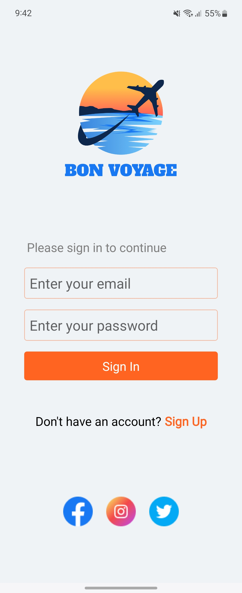
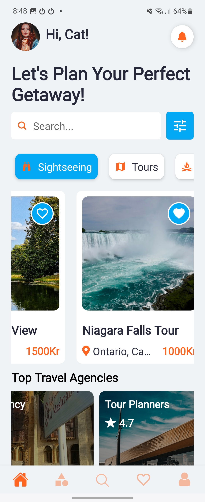
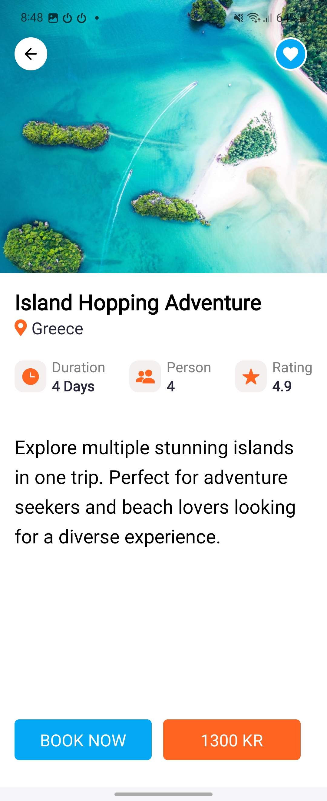
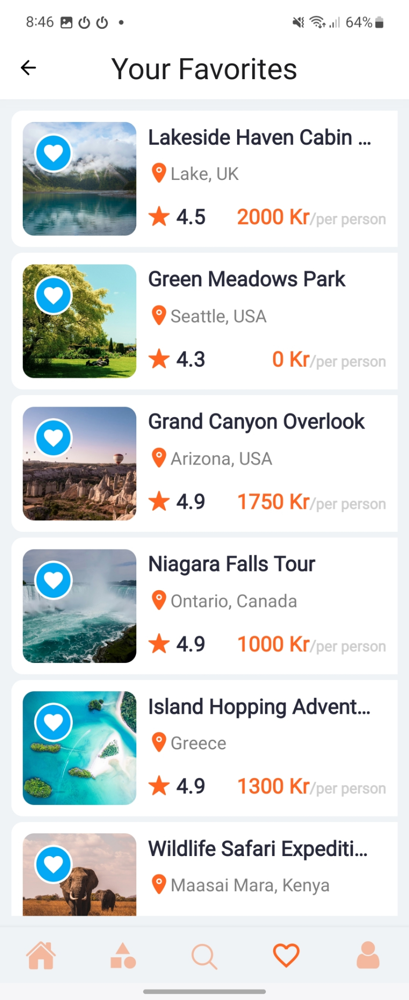

## Bon Voyage - Travel App 

<div style="display: flex; flex-direction: row; flex-wrap: wrap; gap: 20; justify-content: space-around;">
   
   
     
     
</div>

-  -  -  -  -  -

### Description

Bon Voyage is a travel app built with React Native and Expo. The app is designed to help users explore exciting travel destinations,and save their favorites. It also features Firebase authentication for user sign-up and login, searching, and filtering of travel options.
This app was built with the primary goal of learning and practicing React Native, and to apply and extend the knowledge I gained throughout my Front-End Development studies.

### Features

   - Firebase Authentication: Sign up and login with email/password. *[Social media authentication (Google, Facebook, Twitter) to be implemented.]*
   - Browse Destinations
   - Search and Filter
   - Save Favorites

### Technologies

- **React Native**
- **Expo**
- **Firebase**


### Installation

Follow these steps to set up the project locally:

1. **Clone the repository**
    ```bash
    git clone (https://github.com/CatAvadani/travel-app-expo.git)
    cd travel-app-expo
    ```

2. **Install dependencies**
    ```bash
    npm install
    ```

3. **Start the Expo development server**
    ```bash
    npx expo start
    ```

### Usage

 **Run the application on your preferred device/emulator**
    - You can use the Expo Go app on your mobile device to scan the QR code generated by the Expo development server.
    - Alternatively, you can run the app on an iOS/Android emulator.


